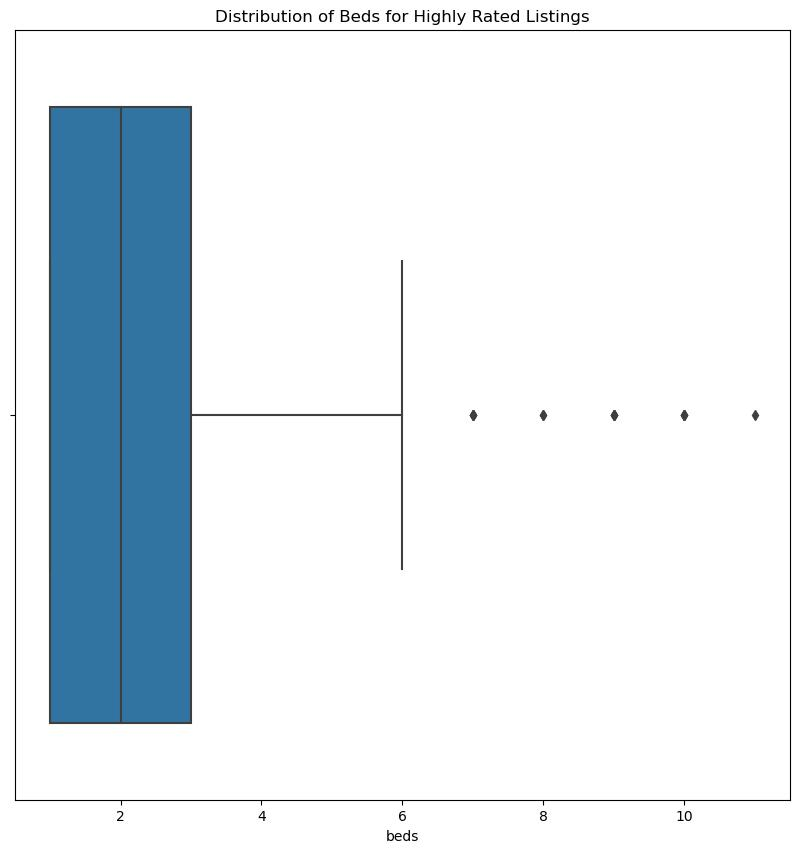

# Executive Summary

## Problem Statement

We are the quality assurance team at Airbnb. At Airbnb, our company values dictate that we consider any review less than five stars to indicate major issues with the property and/or host. 

#### In order to inform our division and provide feedback to hosts, we want to build classification models to predict--based off of either property features or prior reviews--whether a property is poorly or highly rated.  To uphold our stringent expectations for quality, we define poorly rated as less than 4.5 stars and highly rated as greater than 4.9 stars.

We will first build models using data about features of the listings. Next, we will build models using text data of reviews left for the listings. We will compare the performance of the models to see what gives us the best predictions. 

 
## Description of Data
The data used in this project comes from two datasets provided by Airbnb with information on properties in Athens, Greece. The first dataset, listings, provides information on Airbnb listing features such as property type, room type, price, rating, and other aspects of the listing. The second data set, reviews, provides text data of reviews left for listings. 

 
 ## Data Dictionary

|Feature|Type|Dataset|Description|
|---|---|---|---|
|neighbourhood|object|listings_subset| Neighborhood in Athens, Attica, Greece| 
|host_response_time|object|listings_subset| Either within an hour, within a few hours, within a day, or a few days or more. Dummy variables were made for each category|
|host_total_listings_count|float|listings_subset| The number of listings the host has (per Airbnb calculations) |
|host_identity_verified|object|listings_subset| 0 if the host is not verified, 1 if the host is verified|
|property_type|object|listings_subset| Self selected property type. Hotels, bed and breakfasts, and private residences are described as such by their hosts in this field|
|room_type|object|listings_subset| Either entire home/apt, private room, shared room, or hotel. Dummy variables were made for each category|
|accomodates|integer|listings_subset| How many guests the listing accodomodates |
|bathrooms_text|object|listings_subset|How many bathrooms in the listing. Dummy variables were made for each of the categories |
|bedrooms|float|listings_subset| Number of bedrooms |
|beds|float|listings_subset| Number of beds |
|price|float|listings_subset| Daily price|
|minimum_nights|integer|listings_subset|Minimum number of nights the listing can be booked for |
|maximum_nights|integar|listings_subset|Maximum number of nights the listing can be booked for |
|number_of_reviews|integer|listings_subset|The number of reviews the listings has|
|instant_bookable|object|listings_subset|0 if the booking must be approved by the host, 1 if the listing can be instantly booked |
|id|integer|reviews_subset|Unique id for each review|
|comments|object|reviews_subset|Reviews left for Airbnb listings|
|token_comments|object|reviews_subset|Reviews left for Airbnb listings that have been tokenized and cleaned to only have alphanumeric characters|
|lem_comments|object|reviews_subset|Reviews left for Airbnb listings that have first been tokenized and cleaned and then lemmatized|
|language|object|reviews_subset|Language that a language detector identified as most likely for the reviews|
|word_count|integer|reviews_subset|Review word count|
|sentiment|float|reviews_subset|Compound sentiment score for each review, with -1 being entirely negative and 1 being entirely positive sentiment|
|listing_id|integer|listings_subset & reviews_subset|Unique ID for listings|
|reviews_scores_rating|float|listings_subset & reviews_subset|Average rating of the listing out of 5|
|type|integer|listings_subset & reviews_subset|Highly rated (defined as reviews_scores_rating > 4.9) denoted as 0, poorly rated (defined as reviews_scores_rating < 4.5) denoted as 1 |

## Cleaning

### Defining Our Datasets
Originally, we had planned to build prediction models using a subset of the data from one neighborhood and predicting the property ratings as a continuous variable. However, after building initial models and examining the spread of our target variable, we realized that a substantial majority of the reviews were clustered at 4.8 or above, with no reviews for that neighborhood below 3.5, meaning that the variables we selected to explain changes in average property rating would be mostly predicting very small changes with comparatively crude measures like number of bedrooms and bathrooms. This extreme right skew was reflected in the larger data set as well. Because of this, we were seeing very weak performance from our models and knew we would have to take a different approach.

We decided to go back to the full data set and take a subsection of that data set, selecting reviews of listings rated under 4.5 stars and an equal number of randomly selected reviews of listings rated above 4.9 stars to get the extreme ends of the data set. We then classified the reviews as either  reviews of poorly rated listins or reviews of highly rated listings and built classification models to predict the type listing, based on the logic that there is some aspect that makes these categories different that a model could pick up on. 

We used the same logic with our listings dataset so that we could build and compare models using the two different types of data. We took a subsection of the full listings data set, selecting listings rated under 4.5 stars and an equal number of randomly selected listings rated above 4.9 stars to get the extreme ends of the data set.

### Listings Dataset
For our listings dataset, we first selected columns that we felt would be valuable in a prediction model and dropped columns which would not be helpful, such as scrape_ID, picture_URL, host_picture_URL, and similar columns. We dropped a column called "bathrooms" because it contained only null values, and the information on number of bathrooms and bathroom type was contained within a column called "bathroom_text". We dropped all null values in the "review_scores_reading" column because we needed information from that column to classify our listings as highly rated or poorly rated and without that information we would be missing information in our target variable. We dropped the column "neighborhoods" because we realized that the overwhelming majority of our observations came from the same neighborhood and therefore it would not be a helpful variable in predicting difference. We created dummy variables for our categorical variables and used linear imputation to impute values for the remaining null values. Finally, we dropped outliers in the "price" column.

### Reviews Dataset
For our reviews data set, we first dropped all null values in the text column of the reviews, because it would not be possible to impute values for those observations. We then merged the "review_scores_rating" column from the listings data onto our data set using listing id so that we were able to split our reviews by whether they were reviews of a highly rated or poorly rated listing. We then made all reviews lowercase. We used a language detector to approximate what language each review was in. When randomly selecting our subset of data, we only selected from reviews that were in English, predominantly because we wanted to CountVectorize our data and CountVectorizervis to an extent built to be used with English (ex: the only stopword preset is for English). We were not familiar enough with any other language to ensure that CountVectorizer was treating reviews in a different language accurately. We broke our text data into tokens and removed all non-alphanumeric characters. We then lemmatized the token data to transform words to their roots.

## Analysis
### Exploratory Data Analysis
#### Listings
A few operations were performed as an intial exploration of the listings data. 

First, we created distributions to visualize the spread of ratings for poorly and highly rated listings.

This visualization of the distribution of ratings for the poorly rated listings category shows a substantial left skew, demonstrating that even within the poorly rated category, ratings are very frequently close to the upper bound cutoff of 4.5.

This visualization of the distribution of ratings for the highly rated listings category also shows a left skew, although the frequency starts to decrease after 4.95 approaching a 5 star rating and then shoots up to over 700 5 star ratings. This data set is heavily weighted towards high ratings.

We then created box plots to visualize the distribution of all of our quantitative data and to identify outliers. We created a box plot for each quantitative variable for poorly rated listings and separate box plots for each quantitative variable for highly rated listings.

The visualization above of the distribution of price for poorly rated listings shows a right skew with most prices under two hundred dollars per night. The median price was roughly around fifty dollars per night. There were several outliers the largest being around nine hundred dollars per night. We decided to keep these outliers in because it seems reasonable that for any vacation destination there will be some listings that are very costly in comparison to others.

The distribution of price for highly rated listings shows a right skew with most prices under five hundred dollars per night. The median price was roughly around seventy dollars. There were several outliers, with a large outliers of roughly eight thousand dollars per night, five thousand dollars per night, and three thousand dollars per night. We decided to drop these outliers because they were much greater than any of the other nightly prices and potentially could be errors, as three to eight thousand dollars per night seems like a very substantial price. We kept the other outliers because they were between roughly five hundred dollars per night and two thousand dollars per night, which seems like possible nightly prices for very nice vacation properties.

There was some difference in the distribution of price for highly rated listings versus poorly rated listings. Generally, highly rated listings also had a higher price and more extreme outliers.

The distribution of total listings per host for poorly rated listings shows a right skew with most total listings per host under 100 listings. The median was roughly around 10 listings. There were several outliers, the greatest of which was roughly at 600 listings. We decided to keep the outliers in because it is a realistic representation of the fact that some management companies or businesses own and list large numbers of Airbnb properties.

The distribution of total listings per host for highly rated listings shows a right skew with most total listings per host under 50. The median was roughly around 5 listings. There were several outliers, the greatest of which was roughly at 800 listings. We decided to keep the outliers in because it is a realistic representation of the fact that some management companies or businesses own and list large numbers of Airbnb properties. 

The distributions of total listings per host for our two classes were fairly similar, although the highly rated listings had a more extreme outlier of roughly 800 listings under one host.

The distribution of beds for poorly rated listings shows a right skew, with most of the number of beds under seven. The median was roughly around two beds. There were some outliers ranging up to roughly 15 beds. We decided to keep the outliers because they are representative of Airbnb listings meant to accommodate large groups.

The distribution of beds for highly rated listings shows a right skew, with most of the number of beds under seven. The median was roughly around two beds. There were a few outliers ranging up to roughly 11 beds. We decided to keep the outliers because they are representative of Airbnb listings meant to accommodate large groups.

The distribution of beds for our two classes were fairly similar.

The distribution of number of reviews per listing for poorly rated listings shows a right skew, with most of the number of reviews per listing under 50. The median was roughly around 10 reviews per listing. They were many outliers ranging all the way up to an outlier of roughly 475 reviews for one listing. We decided to keep an all the outliers because the outliers may contribute valuable information about types of listings that are more likely to receive many reviews. For example, if a listing is either incredible or awful, it may receive a significantly higher number of reviews.

The distribution of number of reviews per listing for highly rated listings shows a right skew, with most of the number of reviews per listing under 150. There were many outliers, ranging all the way up to an outlier of over 500 reviews for one listing. We decided to keep an all the outliers because the outliers may contribute valuable information about types of listings that are more likely to receive many reviews. For example, if a listing is either incredible or awful, it may receive a significantly higher number of reviews.

The distribution of number of reviews per listing was a bit more spread out for highly rated listings than poorly rated listings.

Next, we created bar charts to look at the frequency of different categories for our categorical variables. We separated our data into poorly rated and highly rated listings and created bar charts for both classes.

This bar chart of the frequencies of different categories of host response time for poorly rated listings shows that the majority of hosts reply within an hour, with the next most frequent category being within a few hours.

This bar chart of the frequencies of different categories of host response time for highly rated listings shows that the majority of hosts reply within an hour, with the next most frequent category being within a few hours, similar to the frequencies of categories for poorly rated listings.

This bar chart of the frequencies of different types of properties for poorly rated listings shows that the majority of properties are entire rental units, with the next most frequent type being entire condos.

This bar chart of the frequencies of different types of properties for highly rated listings shows that the majority of properties are entire rental units, with the next most frequent type being entire condos, similar to the frequencies of categories for poorly rated listings.

The bar chart of the frequency of different room types for poorly rated listings shows that the most frequent room type (by a substantial amount) is an entire home or apartment, followed by private room.

The bar chart of the frequency of different room types for poorly rated listings shows that the most frequent room type (by a substantial amount) is an entire home or apartment, followed by private room, similar to the frequencies of categories for poorly rated listings.

Our early data analysis allowed us to see that there are similarities in the distributions of variables for poorly rated and highly rated listings. However, there may be small differences that a model could pick up on to differentiate between features of  extremely high rated listings vs. less than perfect listings.

#### Reviews
A few operations were performed as an intial exploration of the reviews data. 

First, we created a variable for review word count. We then created distibutions of the word count for all reviews, reviews for poorly rated listings, and reviews for highly rated listings. The histogram of word count for all reviews had a significant right skew, with the majority of the reviews between 0 and 200 words. However, there were outliers in word count, with some reviews having up to 1000 words in the review. The distributions of word count for both highly rated listings and poorly rated listings were very similar (and similar to the distribution of word count for all reviews), both with a substantial right skew and with the majority of reviews concentrated between 0 and 200 words. Both had outliers near or slightly above 1000 words.

This visualization is the distribution of word count for all reviews, and is representative of the distributions of word count for both poorly and highly rated listings as well.

Next, we pulled examples of some of the extremely wordy reviews that made up our word count outliers to see if there was a theme to those long reviews. Three out of four of the reviews over 950 words were very negative and went into great detail about the poor experience the guest had. The other review over 950 words repeated the same review in French after the English review, which contributed to the length of the review. This review was still classified as English by our language detector because there is a substantial amount of English in the text. That review was a positive review but was only very long because it repeated itself. It seems that longer reviews tended to be negative reviews.

We then looked at the mean word count for each of our classes.

The mean word count for poorly rated listings was slightly less than the mean word count for highly rated listings. This is an amendment of our initial conclusion based off the anecdotal evidence of pulling the reviews with the highest word count and finding them to be negative. However, it seems that overall people leaving positive reviews leave slightly longer reviews.

We then ran sentiment analysis on our text data.

The distribution of compound sentiment analysis, which indicates whether text is mainly positive or negative, has a substantial left skew, meaning that the majority of reviews were analyzed to be positive. This fits with what we know about our data, given that even our poorly rated category encompasses ratings from 0 to 4.5 stars out of 5, and many of the listings in the poorly rated category are very close to that 4.5 cut off. It logically follows that our sentiment analysis would find predominantly positive sentiment.

Next, we ran our text data through a CountVectorizer transformer so that the frequency of words could be examined. After transforming the data, we found the 10 most common words for each class to compare to one another.  

The bar charts above show the 10 most common words for reviews of poorly and highly rated listings. The 10 most common words in poorly rated listings reviews might be surprising on initial glance because they include words like a great, good, nice, and clean. However, because of our very high upper bound of poorly rated listings at 4.5 stars, it is not surprising that positive words are seen frequently in these reviews. Comparing the 10 most common words in poorly rated listings reviews and highly rated listings reviews does not result in a striking contrast in language. The highly rated listings reviews also included words like great, place, location, and clean that were seen in the 10 most common words in poorly rated listings reviews. However, a word that made the top 10 in highly rated listings reviews and not poorly rated listings reviews was recommend. This word may indicate the above average experience that we expect for our guests at Airbnb.

When we filter the dataset to include only very low ratings under 2 stars, we see that the 10 most common words in reviews include words like cancel, reservation, automated, and posting. These words are more characteristic with what we would expect to see in negative reviews.

Our early data analysis allowed us to see that there is overlap in the words used for reviews of both of our classes. However, there may be small differences that a model could pick up on to differentiate between reviews left for extremely high rated listings vs. less than perfect listings.
 

 
## Classification Modeling
## Baseline Accuracy
Our baseline accuracy, since we selected equal numbers of high and low ratings to have balanced classes, is 50% for both the listings data and reviews data. 

## Listings Data Models

### Logistic Regression
We built a logistic regression model using the listings data and fit it on our train data. The model had a train accuracy of 0.70 and a test accuracy of 0.68. The model sensitivity was 0.71, the specificity was 0.66, and the precision was 0.68. This model had above baseline accuracy but was not our best performing model.
 
 
 
To visualize the performance of our models, we created confusion matrix plots that displayed the counts of true positives, true negatives, false positives, and false negatives. These visualizations helped us see which models were peforming best, as well as see what types of listings some models were struggling at classifying. The model was slightly worse at classifying highly rated listings correctly than poorly rated listings.

 
### K Nearest Neighbors Classifier

For our K Nearest Neighbors Classifier, we built a pipeline with StandardScaler and KNeighborsClassifier so we could gridsearch for the best hyperparameters. StandardScaler was included in this pipeline because it is necessary to scale data before using KNN models. We did not test any hyperparameters for StandardScaler in GridSearch, but we set with_mean = True. We also GridSearched over KNeighborsClassifier to check whether n_neighbors should be 3, 5, or 7, whether weights should be uniform or distance, and whether metric should be minkowski, euclidian, or manhattan. The GridSearch returns the combination hyperparameters that built the best performing model. The KNN best parameters were: 'knn__metric': 'manhattan', 'knn__n_neighbors': 5, 'knn__weights': 'distance'.
 
We then fit this model on our X_train data. This model had an accuracy score of 1 on the train data and 0.63 on the test data. This model was severely overfit. On test data, the model sensitivity was 0.63, the model specificity was 0.64, and the model precision was 0.65.
 
  
 
To visualize the performance of our models, we created confusion matrix plots that displayed the counts of true positives, true negatives, false positives, and false negatives. These visualizations helped us see which models were peforming best, as well as see what types of listings some models were struggling at classifying. The model was about the same at classifying both classes.
 
### Decision Tree Classifier
For our Decision Tree Classifier, GridSearched over the classifier to check whether n_estimators should be 100, 125, or 150, whether max depth of branches should be 3, 5, or 8, and whether the minimum samples for a leaf should be 1, 2, or 5. The GridSearch returns the hyperparameters that built the best performing model. The Decision Tree best parameters were: 'dt__max_depth': 8, 'dt__min_samples_leaf': 5. 
 
We then fit this model on our X_train data. This model had an accuracy score of 0.76 on the train data and 0.72 on the test data. On test data, the model sensitivity was 0.67, the model specificity was 0.78, and the model precision was 0.76. This model had some difficulty classifying poorly rated listings, frequently labeling them as highly rated, as shown by the very lower sensitivity score. 
 
  
 
To visualize the performance of our models, we created confusion matrix plots that displayed the counts of true positives, true negatives, false positives, and false negatives. These visualizations helped us see which models were peforming best, as well as see what types of listings some models were struggling at classifying.

### Random Forests Classifier
For our Random Forests Decision Trees Classifier, we used GridSeach to check whether n_estimators should be 100, 125, or 150, whether max depth of branches should be 3, 5, or 8, and whether the minimum samples for a leaf should be 1, 2, or 5. The GridSearch returns the hyperparameters that built the best performing model. The Random Forest best parameters were: 'rf__max_depth': 8, 'rf__min_samples_leaf': 2, 'rf__n_estimators': 150. 
 
We then fit this model on our X_train data. This model had an accuracy score of 0.80 on the train data and 0.71 on the test data. On test data, the model sensitivity was 0.72, the model specificity was 0.71, and the model precision was 0.72. This model performed better than the baseline accuracy but was slightly overfit. 
 
  
 
To visualize the performance of our models, we created confusion matrix plots that displayed the counts of true positives, true negatives, false positives, and false negatives. These visualizations helped us see which models were peforming best, as well as see what types of listings some models were struggling at classifying.

### AdaBoost Classifier
For our AdaBoost Classifier, we used GridSeach to check whether n_estimators should be 100, 125, or 150, and whether the learning rate that weights incorrect classifications each iteration of the model should be 1.0 or 1.5. The GridSearch returns the hyperparameters that built the best performing model. The AdaBoost best parameters were: 'ada__learning_rate': 1.5, 'ada__n_estimators': 150. 

    
We then fit this model on our X_train data. This model had an accuracy score of 0.75 on the train data and 0.71 on the test data. On test data, the model sensitivity was 0.71, the model specificity was 0.71, and the model precision was 0.72. 

  
 
To visualize the performance of our models, we created confusion matrix plots that displayed the counts of true positives, true negatives, false positives, and false negatives. These visualizations helped us see which models were peforming best, as well as see what types of listings some models were struggling at classifying. This model performed similarly at identifying both highly and poorly rated listings.

### GradientBoost Classifier
For our GradientBoost Classifier, we used GridSeach to check whether n_estimators should be 100, 125, or 150, and whether the learning rate should be 0.8, 1.0 or 1.5. We set min_samples_split to 2. The GridSearch returns the hyperparameters that built the best performing model. The GradientBoost best parameters were: 'g_boost__learning_rate': 0.8, 'g_boost__n_estimators': 150. 
    
We then fit this model on our X_train data. This model had an accuracy score of 0.98 on the train data and 0.70 on the test data. On test data, the model sensitivity was 0.69, the model specificity was 0.71, and the model precision was 0.71. This model performed better than baseline accuracy but was substantially overfit. 

 
  

To visualize the performance of our models, we created confusion matrix plots that displayed the counts of true positives, true negatives, false positives, and false negatives. These visualizations helped us see which models were peforming best, as well as see what types of listings some models were struggling at classifying. This model performed similarly at identifying both highly and poorly rated listings.
 
### Bagging Classifier
For our Bagging Classifier, we used GridSeach to check whether n_estimators should be 100, 125, or 150, whether max samples should be 0.65, 0.75, 0.85, or 1.0, and whether max features should be 0.65, 0.75, 0.85, or 1.0. The GridSearch returns the hyperparameters that built the best performing model. The Bagging Classifier best parameters were: 'bag__max_features': 0.65, 'bag__max_samples': 0.65, 'bag__n_estimators': 150.
    
We then fit this model on our X_train data. This model had an accuracy score of 1.0 on the train data and 0.71 on the test data. On test data, the model sensitivity was 0.68, the model specificity was 0.74, and the model precision was 0.73. This model performed better than baseline accuracy but was substantially overfit. 

 Bagging l: Train accuracy: 1.0, Test accuracy: 0.71
sensitivity: 0.68 Specificity: 0.74 Precision: 0.73

 

To visualize the performance of our models, we created confusion matrix plots that displayed the counts of true positives, true negatives, false positives, and false negatives. These visualizations helped us see which models were peforming best, as well as see what types of listings some models were struggling at classifying. This model was slightly worse at classifying poorly rated listings.

## Reviews Data Models

### Logistic Regression
For our logistic regression, we built a pipeline with CountVectorizer and Logistic Regression so we could gridsearch for the best hyperparameters. We used GridSeach to check whether CountVectorizer stop words should be none or english, whether CountVectorizer ngram_range should be only single words or single words and word pairs, and whether CountVectorizer max_df should be 0.9 or 1.0. We also GridSearched over Logistic Regression to check whether logreg_solver should be lbfgs or liblinear. The GridSearch returns the combination hyperparameters that built the best performing model. The Logistic Regression best parameters were: 'cvec__max_df': 0.9, 'cvec__ngram_range': (1, 1),'cvec__stop_words': 'none', 'logreg__solver': 'liblinear'. 
 
We then fit this model on our X_train data. This model had an accuracy score of 0.86 on the train data and 0.77 on the test data. On test data, the model sensitivity was 0.80, the model specificity was 0.74, and the model precision was 0.75. This model performed better than our baseline, but there was some evidence of overfitting, seen by the decrease in performance from train data to test data. 

 

To visualize the performance of our models, we created confusion matrix plots that displayed the counts of true positives, true negatives, false positives, and false negatives. These visualizations helped us see which models were peforming best, as well as see what types of listings some models were struggling at classifying.

### K Nearest Neighbors Classifier
For our K Nearest Neighbors Classifier, we built a pipeline with CountVectorizer, StandardScaler and KNeighborsClassifier so we could gridsearch for the best hyperparameters. StandardScaler was included in this pipeline because it is necessary to scale data before using KNN models. We used GridSeach to check whether CountVectorizer stop words should be none or english, whether CountVectorizer ngram_range should be only single words or single words and word pairs, and whether CountVectorizer max_df should be 0.9 or 1.0. We did not test any hyperparameters for StandardScaler in GridSearch, but we set with_mean = False. We also GridSearched over KNeighborsClassifier to check whether n_neighbors should be 3, 5, or 7, whether weights should be uniform or distance, and whether metric should be minkowski, euclidian, or manhattan. The GridSearch returns the combination hyperparameters that built the best performing model. The KNN best parameters were: 'cvec__max_df': 0.9, 'cvec__ngram_range': (1, 1), 'cvec__stop_words': 'english', 'knn__metric': 'minkowski', 'knn__n_neighbors': 7, 'knn__weights': 'distance'.
 
We then fit this model on our X_train data. This model had an accuracy score of 1 on the train data and 0.66 on the test data. This model was severely overfit. On test data, the model sensitivity was 0.78, the model specificity was 0.55, and the model precision was 0.63. This model had difficulty classifying highly rated listings, labeling them as poorly rated listings, as shown by the very low specificity score.

To visualize the performance of our models, we created confusion matrix plots that displayed the counts of true positives, true negatives, false positives, and false negatives. These visualizations helped us see which models were peforming best, as well as see what types of listings some models were struggling at classifying.

### Decision Tree Classifier
For our Decision Tree Classifier, we built a pipeline with CountVectorizer and Decision Tree Classifier so we could gridsearch for the best hyperparameters. We used GridSeach to check whether CountVectorizer stop words should be none or english, whether CountVectorizer ngram_range should be only single words or single words and word pairs, and whether CountVectorizer max_df should be 0.9 or 1.0. We also GridSearched over Decision Tree Classifier to check whether max depth of branches should be 3, 5, or 8, and whether the minimum samples for a leaf should be 1, 2, or 5. The GridSearch returns the combination hyperparameters that built the best performing model. The Decision Tree best parameters were: 'cvec__max_df': 0.9, 'cvec__ngram_range': (1, 2), 'cvec__stop_words': None, 'dt__max_depth': 8, 'dt__min_samples_leaf': 5. 
 
We then fit this model on our X_train data. This model had an accuracy score of 0.68 on the train data and 0.65 on the test data. On test data, the model sensitivity was 0.66, the model specificity was 0.65, and the model precision was 0.65. This model was not very accurate but classified highly rated properties and poorly rated properties with about the same accuracy.

To visualize the performance of our models, we created confusion matrix plots that displayed the counts of true positives, true negatives, false positives, and false negatives. These visualizations helped us see which models were peforming best, as well as see what types of listings some models were struggling at classifying.

### Random Forests Classifier
For our Random Forests Decision Trees Classifier, we built a pipeline with CountVectorizer and Random Forest Classifier so we could gridsearch for the best hyperparameters. We used GridSeach to check whether CountVectorizer stop words should be none or english, whether CountVectorizer ngram_range should be only single words or single words and word pairs, and whether CountVectorizer max_df should be 0.9 or 1.0. We also GridSearched over Random Forest Classifier to check whether n_estimators should be 100, 125, or 150, whether max depth of branches should be 3, 5, or 8, and whether the minimum samples for a leaf should be 1, 2, or 5. The GridSearch returns the combination hyperparameters that built the best performing model. The Random Forest best parameters were: 'cvec__max_df': 0.9, 'cvec__ngram_range': (1, 1), 'cvec__stop_words': English, 'rf__max_depth': 8, 'rf__min_samples_leaf': 2, 'rf__n_estimators': 150. 
 
We then fit this model on our X_train data. This model had an accuracy score of 0.73 on the train data and 0.71 on the test data. On test data, the model sensitivity was 0.78, the model specificity was 0.65, and the model precision was 0.68. This model was better at classifying poorly rated listings correctly than highly rated listings, as seen by the lower specificity.

To visualize the performance of our models, we created confusion matrix plots that displayed the counts of true positives, true negatives, false positives, and false negatives. These visualizations helped us see which models were peforming best, as well as see what types of listings some models were struggling at classifying.

### AdaBoost Classifier
For our AdaBoost Classifier, we built a pipeline with CountVectorizer and AdaBoost Classifier so we could gridsearch for the best hyperparameters. We used GridSeach to check whether CountVectorizer stop words should be none or english, whether CountVectorizer ngram_range should be only single words or single words and word pairs, and whether CountVectorizer max_df should be 0.9 or 1.0. We also GridSearched over AdaBoost Classifier to check whether n_estimators should be 100, 125, or 150, and whether the learning rate that weights incorrect classifications each iteration of the model should be 1.0 or 1.5. The GridSearch returns the combination hyperparameters that built the best performing model. The AdaBoost best parameters were: 'cvec__max_df': 0.9, 'cvec__ngram_range': (1, 2), 'cvec__stop_words': None, 'ada__learning_rate': 1.0, 'ada__n_estimators': 150. 

    
We then fit this model on our X_train data. This model had an accuracy score of 0.75 on the train data and 0.73 on the test data. On test data, the model sensitivity was 0.77, the model specificity was 0.70, and the model precision was 0.71. This model performed comparably to the random forests model. The model was slightly better at accurately classifying poorly rated listings than highly rated listings. 

To visualize the performance of our models, we created confusion matrix plots that displayed the counts of true positives, true negatives, false positives, and false negatives. These visualizations helped us see which models were peforming best, as well as see what types of listings some models were struggling at classifying.

### GradientBoost Classifier
For our GradientBoost Classifier, we built a pipeline with CountVectorizer and GradientBoost Classifier so we could gridsearch for the best hyperparameters. We used GridSeach to check whether CountVectorizer stop words should be none or english, whether CountVectorizer ngram_range should be only single words or single words and word pairs, and whether CountVectorizer max_df should be 0.9 or 1.0. We also GridSearched over GradientBoost Classifier to check whether n_estimators should be 100, 125, or 150 and whether the learning rate should be 0.8, 1.0, or 1.5. We set the minimum samples to split on to 2. The GridSearch returns the combination hyperparameters that built the best performing model. The GradientBoost best parameters were: 'cvec__max_df': 0.9, 'cvec__ngram_range': (1, 1), 'cvec__stop_words': None, 'g_boost__learning_rate': 0.8, 'g_boost__n_estimators': 150. 

    
We then fit this model on our X_train data. This model had an accuracy score of 0.80 on the train data and 0.75 on the test data. On test data, the model sensitivity was 0.77, the model specificity was 0.73, and the model precision was 0.73. The model was slightly better at accurately classifying poorly rated listings than highly rated listings. 

To visualize the performance of our models, we created confusion matrix plots that displayed the counts of true positives, true negatives, false positives, and false negatives. These visualizations helped us see which models were peforming best, as well as see what types of listings some models were struggling at classifying.

### Bagging Classifier
For our Bagging Classifier, we built a pipeline with CountVectorizer and Bagging Classifier so we could gridsearch for the best hyperparameters. We used GridSeach to check whether CountVectorizer stop words should be none or english, whether CountVectorizer ngram_range should be only single words or single words and word pairs, and whether CountVectorizer max_df should be 0.9 or 1.0. We also GridSearched over Bagging Classifier to check whether n_estimators should be 50, 100, or 150, whether max_samples should be 0.65, 0.75, 0.85, or 1.0, and whether max features should be .65, 0.75, 0.85, or 1.0. 

However, our bagging classifier model using review text data ran for over 24 hours both times we tried to fit it and we were not able to fit the model and score it by the time of this capstone's completion. In the future, we may run this model again to see if it best predicts our classes.

## Neural Network Models

We ran three different neural network models  using our reviews text data to see if they would have greater predictive ability than our other classification models. 

### Model 1
Our first neural net model consisted of three dense layers, ending in a sigmoid activation for binary classification. We fit our model using an epoch size of 100 and a batch size of 64. Our model had a train accuracy of 0.81 and a test accuracy of 0.53, meaning that the model was very overfitted.

### Model 2 
Our second neural net model consisted of six dense layers, ending in a sigmoid activation for binary classification. We added these extra layers to try to improve the accuracy of the model by making it more complex. We fit our model using an epoch size of 100 and a batch size of 64. Our model had a train accuracy of 0.84 and a test accuracy of 0.54, meaning that the model was very overfitted.

### Model 3

Our third neural net model consisted of nine dense layers, ending in a sigmoid activation for binary classification. We added these extra layers to try to improve the accuracy of the model by making it more complex. We also tried to address the overfitting of our first models by using regularization techniques such as dropout layers, kernel regularizers, and early stopping. We fit our model using an epoch size of 100 and a batch size of 64. The model was early stopped after 6 epochs. Our model had a train accuracy of 0.58 and a test accuracy of 0.56. This model did not have as much variance bias as the first two models but is still performing barely above baseline accuracy. Because some of our other models that weren't neural networks were performing substantially better than these models, we decided that neural networks may not be the best fit for our data.

# Conclusions
We were able to answer our problem statement by building a classification model that predicts whether a listing is poorly or highly rated at above baseline accuracy (0.50). We were able to achieve this with both models fit using data on the features of the listings (our listings dataset) and models fit using text data from reviews of the listings (our reviews dataset). With both models, we were able to achieve above 0.71 test accuracy at classifying listings.

When comparing models built using data on features of the Airbnb listings and models built using text data from reviews left about the listings, the highest performance was seen with a model using reviews text data. The logistic regression model using review data had a 0.77 test accuracy. Overall, the models built using reviews text data performed slightly higher than models built using the listings data. 

The best performing model built using our listings data set what is the Decision Tree model. This model has a 0.72 test accuracy and does not suffer from variance bias. 

As mentioned above, the best performing model built with reviews data was the logistic regression model, with a test accuracy of 0.77. However, the logistic regression model does suffer from some overfitting. The Gradient Boost model built with reviews data performs comparably with the logistic regression model, with a test accuracy of 0.75. The Gradient Boost model is not overfit, and therefore may be a better choice of prediction model for this type of data.

By far the worst performing models were the neural network models built using reviews text data. Even when the number of layers were increased, the models performed with lower than 0.60 test accuaracy.

# Recommendations and Future Directions 

If you have access to prior reviews of a listing and and are trying to predict whether it will be a poorly rated or highly rated listing, we recommend using the Gradient Boost model trained on reviews text data. This model had 0.75 test accuracy. While this wasn't the highest performing model (the logistic regression reviews model had 0.77 test accuracy), the GradientBoost model does not have as much variance bias as the logistic regression model and still performs comparably well. 

If trying to predict whether a new Airbnb listing (that doesn't have any past reviews) will be a poorly rated or highly rated property, we recommend using the Decision Tree model trained on listings data (features of the listing). This model had 0.72 test accuracy and was not overfit. 

Although we were able to answer our problem question by building a model that was able to predict with above baseline accuracy whether a listing was a highly rated or poorly rated listing, we want to expand upon this project to try identify what features the model is picking up on that allows it to make the distinction between our two classes. Because our poorly rated class still contains ratings as high as 4.49, it seems that there must be a factor our model is picking up on that sets reviews that are 5 stars or within 0.1 of 5 stars apart from still high reviews. This supports our Airbnb values that anything less than 5 stars indicates an issue. 

Our next step with this data will to be to check the LINE assumptions to see if we are able to use the coefficients of the logistic regression models for inference to determine what are the salient features the model is using to predict.